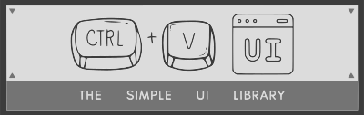

## Description

A simple copy/paste solution for react components styled with TailwindCSS

## Installation

Instructions on how to install and set up the project locally.

```bash
# Clone the repository
$ git clone https://github.com/username/project.git

# Navigate to the project directory
$ cd project

# Install dependencies
$ npm install

# Start the development server
$ npm start
